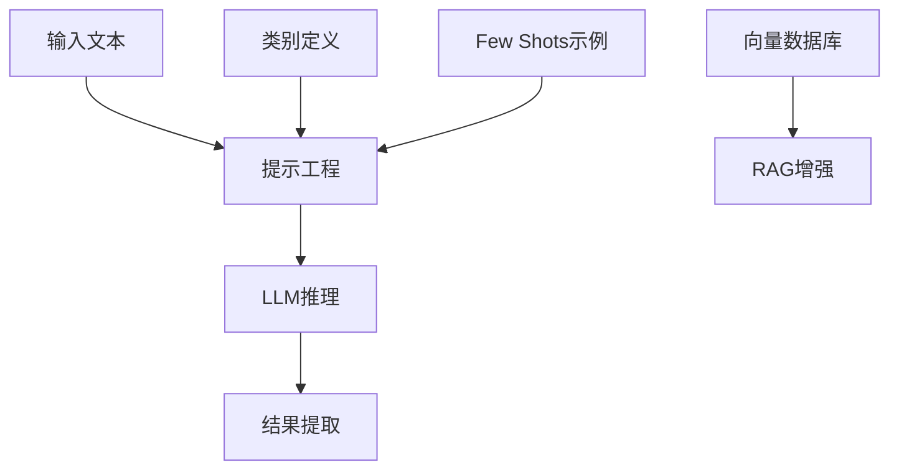

# 大模型分类任务开发实战指南

大型语言模型(LLMs)已成为复杂分类场景的理想解决方案，尤其在传统机器学习方法面临数据有限、规则复杂挑战时表现卓越。本文聚焦提示词工程、RAG 增强和 Few Shots 学习等核心技术，解析如何高效构建基于 LLM 的分类系统。

## 分类系统架构设计



分类系统的核心流程围绕提示工程展开，结合 RAG 增强和 Few Shots 学习可显著提升分类准确性。系统设计需关注数据流转效率与结果可解释性，特别适合保险票据、客户服务工单等高价值场景。

## 提示工程核心技巧

提示设计是 LLM 分类性能的关键，以下是经过实战验证的核心技巧：

### 1. 结构化表示法

采用 XML 或 JSON 格式封装类别定义和输入文本，提升模型理解效率：

```
# 类别定义示例
<categories>
    <category>
        <label>账单查询</label>
        <description>关于发票、费用、收费和保费的问题</description>
    </category>
    <category>
        <label>政策咨询</label>
        <description>关于保险政策条款、覆盖范围和除外责任的问题</description>
    </category>
</categories>

# 输入文本
<content>我的保险费为什么比上个月高了？</content>
```

### 2. 边界控制与结果约束

通过明确的指令和停止序列控制模型输出范围：

```
请根据提供的类别，对输入文本进行分类。
- 只需返回类别标签，不添加任何解释
- 如果无法分类，请返回"其他"

类别: [账单查询, 政策咨询, 理赔申请, 投诉建议, 其他]
输入: 我想了解我的保险是否涵盖意外医疗费用
输出:
```

### 3. 思维链提示

对于复杂分类任务，引导模型逐步思考：

```
我需要对客户的问题进行分类。首先，我会分析问题的核心内容，然后匹配最相关的类别。

客户问题: "我的汽车保险理赔需要提供哪些材料？"
分析: 这个问题是关于理赔过程中所需的材料，属于理赔相关的咨询。
类别匹配: 理赔申请
最终分类: 理赔申请
```

## Few Shots 学习技术

Few Shots 学习通过提供少量示例，帮助模型快速适应特定任务：

### 1. 示例选择策略

```
# 选择多样化示例覆盖主要类别
示例1:
输入: "我的账单金额有误"
分类: 账单查询

示例2:
输入: "我想更改我的保险受益人"
分类: 政策变更

示例3:
输入: "我的车辆在事故中受损，如何申请理赔？"
分类: 理赔申请
```

### 2. 示例排序优化

```
# 按与输入的相关性排序示例
1. 最相关示例
输入: "我的保险费为什么上涨了？"
分类: 账单查询

2. 次相关示例
输入: "我想了解我的保险 coverage"
分类: 政策咨询
```

## RAG 增强技术应用

检索增强生成(RAG)通过引入外部知识提升分类准确性：

### 1. 向量数据库构建与检索

```
# 1. 准备知识库文档
文档1: 保险理赔流程指南
文档2: 保险政策条款解释
文档3: 常见账单问题解答

# 2. 构建向量数据库
为每个文档创建嵌入向量并存储

# 3. 检索相关文档
对于输入文本，检索最相关的2-3个文档片段
```

### 2. 检索结果融合提示

```
# 结合检索结果和输入文本进行分类
检索到的相关信息:
[来自文档3] 常见账单问题包括费用上涨原因、账单错误等

输入文本: 我的保险费为什么比上个月高了？

请根据以上信息，将输入文本分类到以下类别之一:
[账单查询, 政策咨询, 理赔申请, 投诉建议, 其他]
```

## 技术整合示例

以下是整合提示词工程、RAG 技术和 Few Shots 学习的完整分类系统伪代码：

```python
# 整合分类系统实现
class LLMClassifier:
    def __init__(self, llm_client, vector_db):
        self.llm_client = llm_client
        self.vector_db = vector_db
        self.categories = self._load_categories()
        self.few_shot_examples = self._load_few_shot_examples()

    def _load_categories(self):
        # 加载类别定义
        return {
            "账单查询": "关于发票、费用、收费和保费的问题",
            "政策咨询": "关于保险政策条款、覆盖范围和除外责任的问题",
            "理赔申请": "关于理赔流程、材料和状态的问题",
            "投诉建议": "对服务、流程或结果的投诉和建议",
            "其他": "无法分类到以上类别的问题"
        }

    def _load_few_shot_examples(self):
        # 加载Few Shots示例
        return [
            {"input": "我的账单金额有误", "label": "账单查询"},
            {"input": "我想更改我的保险受益人", "label": "政策咨询"},
            {"input": "我的车辆在事故中受损，如何申请理赔？", "label": "理赔申请"}
        ]

    def _retrieve_relevant_docs(self, query, top_k=2):
        # RAG检索相关文档
        return self.vector_db.search(query, top_k=top_k)

    def _build_prompt(self, query, relevant_docs):
        # 构建整合提示
        prompt = """
        任务：将客户问题分类到以下类别之一：{categories}

        类别定义：
        {category_definitions}

        相关知识：
        {relevant_knowledge}

        示例：
        {few_shot_examples}

        请按照以下步骤分类：
        1. 分析客户问题的核心内容
        2. 结合相关知识和示例，匹配最相关的类别
        3. 只返回类别标签，不添加任何解释

        客户问题："{query}"
        分类结果：
        """

        # 填充模板
        categories_str = ", ".join(self.categories.keys())
        category_definitions = "\n".join([f"- {k}: {v}" for k, v in self.categories.items()])
        relevant_knowledge = "\n".join([f"- {doc}" for doc in relevant_docs])
        few_shot_examples = "\n".join([f"输入: \"{ex['input']}\"\n分类: {ex['label']}" for ex in self.few_shot_examples])

        return prompt.format(
            categories=categories_str,
            category_definitions=category_definitions,
            relevant_knowledge=relevant_knowledge,
            few_shot_examples=few_shot_examples,
            query=query
        )

    def classify(self, query):
        # 1. RAG检索相关文档
        relevant_docs = self._retrieve_relevant_docs(query)

        # 2. 构建整合提示
        prompt = self._build_prompt(query, relevant_docs)

        # 3. LLM推理
        response = self.llm_client.generate(
            prompt=prompt,
            max_tokens=100,
            temperature=0.0
        )

        # 4. 提取结果
        result = response.strip()
        return result if result in self.categories else "其他"

# 使用示例
if __name__ == "__main__":
    # 初始化LLM客户端和向量数据库
    llm_client = initialize_llm_client()  # 初始化LLM客户端
    vector_db = initialize_vector_db()   # 初始化向量数据库

    # 创建分类器
    classifier = LLMClassifier(llm_client, vector_db)

    # 测试分类
    test_queries = [
        "我的保险费为什么比上个月高了？",
        "我想了解我的保险是否涵盖意外医疗费用？",
        "我的汽车保险理赔需要提供哪些材料？"
    ]

    for query in test_queries:
        category = classifier.classify(query)
        print(f"查询: {query}\n分类结果: {category}\n")
```

通过以上核心技术的综合应用，可构建高效、准确的 LLM 分类系统，为保险、金融、客服等领域的文本分类需求提供强大解决方案。
